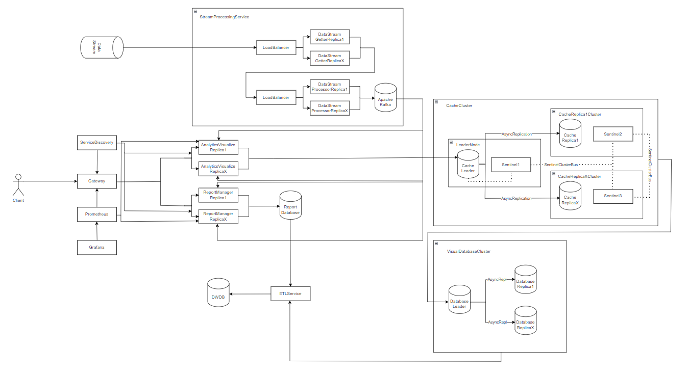

# PAD Laboratory Work - Stream Analytics for Real-Time Fraud Detection

The current Markdown document describes the architecture and technical aspects
of a microservices-based system that aims to detect fraud given a stream of suitable 
incoming data. The project is developed during the Distributed Application Design 
(PAD) course, at Technical University of Moldova.

## Application Suitability

The main aspects why the proposed application is suitable as laboratory work for 
PAD course are the following:
- Real-Time Data Request and Processing: data can be obtained from multiple sources
(apis, scrapping sites), being split in streams in real time, and, eventually, 
processed.
- Processed Data Aggregation and Transformation: usually with a streaming analytics 
platform or an ELT or ETL tool like Apache Spark or Hadoop.
- Consistent and Timely System Response: aggregated data is continuously stored and 
queried into the SQL-based Data Base using tools like SQL Spark.
- Separated Component Logic: each described microservice responds for one concrete
task (Data Streaming Ingestion, Processing, etc.).

## Architecture

The developed system is planned to have the architecture presented in Figure 1.

<p align="center">
    
<br><em>Figure 1. The architecture of the described system</em>
</p>

## Service Boundaries

Based on the architecture of the system, presented in Figure 1, the following 
components and their functionalities can be denoted:
- __Gateway__: the route the client uses for requests;
- __LoadBalancer__: track the load on the components and decides which one 
  should handle the next stream, when to create and destroy components of the same 
  type;
- __StreamProcessingService__: the service that gets and processes all gotten data, 
storing it into a temporary storage afterward; several components can be mentioned:
    - _DataStreamGetter_: the entity that gets all data from and stores it into
  the temporary data store;
    - _DataStreamProcessor_: the entity that processes all the analytics from
  the gotten data and stores the result in the Data Base.
- __AnalyticsVisualizer__: the service that get processed data and output it as 
diagrams for visualization;
- __ReportManager__: the service that get processed data and generate a report in 
a human-readable format based it.

## Technology Stack and Communication Pattens

For the implementation of the proposed project, the technology stack listed below
is proposed:
- __StreamProcessingService__ - _Elixir_ for the Back End and _Apache Kafka_ for
Temporary Storage;
- __Gateway__, __AnalyticsVisualizer__, __ReportManager__ - _Python_ with 
_FAST Api_ (as it is developed to be suitable for real-time applications) for 
Back End and MongoDB for Data Base, as it offers a higher speed performance
dealing with file objects manipulation, which is crucial for a Real-Time Streaming
System.

For communication, it is planned to use Apache Kafka to connect _StreamProcessorService_
with other services, as the data should be "streamed" asynchronously, in real
time. In terms of other services, REST API will be used, implying operation
with HTTP protocol.

## Data Management Design

The system will have pre-defined endpoints to get each type of data, that are 
described below. Each message directed towards a certain endpoint will be in 
JSON format, to ensure the consistence in communication.

The following endpoints are planned to be added to the described system:

### Common

- **API Health Checking**
```
Endpoint: /health
Method: GET
params: {}
payload: {}
Response: 
status: status_code 
status_text: status_message
body:
{
  "data_base": string{"none" / "connected" / "disconnected"},
  "load": string{"ok" / "full"}
}
Response example:

status: 200 
status_text: OK
body:
{
  "data_base": "none",
  "load": "ok"
}

status: 503 
status_text: Service Unavailable
body:
{
  "data_base": "disconnected",
  "load": "ok"
}

status: 503 
status_text: Service Unavailable
body:
{
  "data_base": "connected",
  "load": "full"
}
```

### Gateway

```
Endpoint: /home
Method: GET
params: {}
payload: {}
Response:
status: status_code 
status_text: status_message
body:
{
  "session_id": str
}

Response example:
status: 200 
status_text: OK
body:
{
  "session_id": AGAYGUJNKDML3JPJKKGUFJC
}
```

- **Data Visualization for default period of time (3 months)**

```
Endpoint: /data_visualization
Method: GET
header: {
  "session_id": AGAYGUJNKDML3JPJKKGUFJC
}
params: {}
payload: {}
Response: 
status: status_code 
status_text: status_message
body:
{
  "start_date": str,
  "end_date": str,
  "chart_data": {
    [
      "timestamp": str,
      "processed_data": int
    ],
    ...
    [
      "timestamp": str,
      "processed_data": int
    ]
  }
}

Response example:

status: 200 
status_text: OK
body:
{
  "start_date": "2023-09-01 16:21:12",
  "end_date": "2023-09-27 16:21:12",
  "chart_data": {
    [
      "timestamp": "1625309472.357246",
      "processed_data": 2503
    ],
    ...
    [
      "timestamp": "1625309457.357246",
      "processed_data": 1865
    ]
  }
}
```

- Data Visualization within the specified number of days

```
Endpoint: /data_visualization/day
Method: GET
header: {
  "session_id": AGAYGUJNKDML3JPJKKGUFJC
}
params: {
  "nr_days": int [default: 1]
}
payload: {}
Response: 
status: status_code 
status_text: status_message
body:
{
  "start_time": str,
  "end_time": str,
  "chart_data": {
    [
      "timestamp": str,
      "processed_data": int
    ],
    ...
    [
      "timestamp": str,
      "processed_data": int
    ]
  }
}

Response example:

status: 200 
status_text: OK
body:
{
  "start_time": "2023-09-26 16:21:12",
  "end_time": "2023-09-27 16:21:11",
  "chart_data": {
    [
      "timestamp": "1625309472.357246",
      "processed_data": 2503
    ],
    ...
    [
      "timestamp": "1625309457.357246",
      "processed_data": 1865
    ]
  }
}
```

- Data Visualization within the specified number of weeks

```
Endpoint: /data_visualization/week
Method: GET
header: {
  "session_id": AGAYGUJNKDML3JPJKKGUFJC
}
params: {
  "nr_weeks": int [default: 1]
}
Response: 
status: status_code 
status_text: status_message
body:
{
  "start_time": str,
  "end_time": str,
  "chart_data": {
    [
      "timestamp": str,
      "processed_data": int
    ],
    ...
    [
      "timestamp": str,
      "processed_data": int
    ]
  }
}

Response example:

status: 200 
status_text: OK
body:
{
  "start_date": "2023-09-21 16:21:12",
  "end_date": "2023-09-27 16:21:12",
  "chart_data": {
    [
      "timestamp": "1625309472.357246",
      "processed_data": 2503
    ],
    ...
    [
      "timestamp": "1625309457.357246",
      "processed_data": 1865
    ]
  }
}
```

- Data Visualization within the specified number of months

```
Endpoint: /data_visualization/month
Method: GET
header: {
  "session_id": AGAYGUJNKDML3JPJKKGUFJC
}
params: {
  "nr_months": int [default: 1]
}
Response: 
status: status_code 
status_text: status_message
body:
{
  "start_time": str,
  "end_time": str,
  "chart_data": {
    [
      "timestamp": str,
      "processed_data": int
    ],
    ...
    [
      "timestamp": str,
      "processed_data": int
    ]
  }
}

Response example:

status: 200 
status_text: OK
body:
{
  "start_date": "2023-08-28 16:21:12",
  "end_date": "2023-09-27 16:21:12",
  "chart_data": {
    [
      "timestamp": "1625309472.357246",
      "processed_data": 2503
    ],
    ...
    [
      "timestamp": "1625309457.357246",
      "processed_data": 1865
    ]
  }
}
```

- **Report generation for monitoring dynamic of the analyzed data for the specified
time period**

```
Endpoint: /report_generation
Method: GET
header: {
  "session_id": AGAYGUJNKDML3JPJKKGUFJC
}
params: {
  "nr_days": int [default: 1]
}
Response: 
status: status_code 
status_text: status_message
body:
{
  "file_name": str,
  "file_content": object[File]
}

Response example:

status: 200 
status_text: OK
body:
{
  "file_name": "Test_report_1",
  "file_content": File(Test_report_1)
}
```

- **Report retrieving based on the report name**

```
Endpoint: /report_retrieving
header: {
  "session_id": AGAYGUJNKDML3JPJKKGUFJC
}
Method: GET
params: {
  "report_name": str [default: "none"]
}
Response: 
status: status_code 
status_text: status_message
body:
{
  "file_name": str,
  "file_content": object[File]
}

Response example:

status: 200 
status_text: OK
body:
{
  "file_name": "Test_report_1",
  "file_content": File(Test_report_1)
}

[params: {"file_name": "none"}]
status: 400 
status_text: Bad Request
body:
{}

[header: {}]
status: 500 
status_text: Internal Server Error
body:
{}
```

### AnalyticsVisualizer

- Data Visualization for default period of time (3 months)

```
Endpoint: /data_visualization
Method: GET
header: {
  "session_id": AGAYGUJNKDML3JPJKKGUFJC
}
params: {}
payload: {}
Response: 
status: status_code 
status_text: status_message
body:
{
  "start_date": str,
  "end_date": str,
  "chart_data": {
    [
      "timestamp": str,
      "processed_data": int
    ],
    ...
    [
      "timestamp": str,
      "processed_data": int
    ]
  }
}

Response example:

status: 200 
status_text: OK
body:
{
  "start_date": "2023-09-01 16:21:12",
  "end_date": "2023-09-27 16:21:12",
  "chart_data": {
    [
      "timestamp": "1625309472.357246",
      "processed_data": 2503
    ],
    ...
    [
      "timestamp": "1625309457.357246",
      "processed_data": 1865
    ]
  }
}
```

- Data Visualization within the specified number of days

```
Endpoint: /data_visualization/day
Method: GET
header: {
  "session_id": AGAYGUJNKDML3JPJKKGUFJC
}
params: {
  "nr_days": int [default: 1]
}
payload: {}
Response: 
status: status_code 
status_text: status_message
body:
{
  "start_time": str,
  "end_time": str,
  "chart_data": {
    [
      "timestamp": str,
      "processed_data": int
    ],
    ...
    [
      "timestamp": str,
      "processed_data": int
    ]
  }
}

Response example:

status: 200 
status_text: OK
body:
{
  "start_time": "2023-09-26 16:21:12",
  "end_time": "2023-09-27 16:21:11",
  "chart_data": {
    [
      "timestamp": "1625309472.357246",
      "processed_data": 2503
    ],
    ...
    [
      "timestamp": "1625309457.357246",
      "processed_data": 1865
    ]
  }
}
```

- Data Visualization within the specified number of weeks

```
Endpoint: /data_visualization/week
Method: GET
header: {
  "session_id": AGAYGUJNKDML3JPJKKGUFJC
}
params: {
  "nr_weeks": int [default: 1]
}
Response: 
status: status_code 
status_text: status_message
body:
{
  "start_time": str,
  "end_time": str,
  "chart_data": {
    [
      "timestamp": str,
      "processed_data": int
    ],
    ...
    [
      "timestamp": str,
      "processed_data": int
    ]
  }
}

Response example:

status: 200 
status_text: OK
body:
{
  "start_date": "2023-09-21 16:21:12",
  "end_date": "2023-09-27 16:21:12",
  "chart_data": {
    [
      "timestamp": "1625309472.357246",
      "processed_data": 2503
    ],
    ...
    [
      "timestamp": "1625309457.357246",
      "processed_data": 1865
    ]
  }
}
```

- Data Visualization within the specified number of months

```
Endpoint: /data_visualization/month
Method: GET
header: {
  "session_id": AGAYGUJNKDML3JPJKKGUFJC
}
params: {
  "nr_months": int [default: 1]
}
Response: 
status: status_code 
status_text: status_message
body:
{
  "start_time": str,
  "end_time": str,
  "chart_data": {
    [
      "timestamp": str,
      "processed_data": int
    ],
    ...
    [
      "timestamp": str,
      "processed_data": int
    ]
  }
}

Response example:

status: 200 
status_text: OK
body:
{
  "start_date": "2023-08-28 16:21:12",
  "end_date": "2023-09-27 16:21:12",
  "chart_data": {
    [
      "timestamp": "1625309472.357246",
      "processed_data": 2503
    ],
    ...
    [
      "timestamp": "1625309457.357246",
      "processed_data": 1865
    ]
  }
}
```

### ReportManager
- Report generation for monitoring dynamic of the analyzed data for the specified
time period

```
Endpoint: /report_generation
Method: GET
header: {
  "session_id": AGAYGUJNKDML3JPJKKGUFJC
}
params: {
  "nr_days": int [default: 1]
}
Response: 
status: status_code 
status_text: status_message
body:
{
  "file_name": str,
  "file_content": object[File]
}

Response example:

status: 200 
status_text: OK
body:
{
  "file_name": "Test_report_1",
  "file_content": File(Test_report_1)
}
```

- Report retrieving based on the report name

```
Endpoint: /report_retrieving
header: {
  "session_id": AGAYGUJNKDML3JPJKKGUFJC
}
Method: GET
params: {
  "report_name": str [default: "none"]
}
Response: 
status: status_code 
status_text: status_message
body:
{
  "file_name": str,
  "file_content": object[File]
}

Response example:

status: 200 
status_text: OK
body:
{
  "file_name": "Test_report_1",
  "file_content": File(Test_report_1)
}

[params: {"file_name": "none"}]
status: 400 
status_text: Bad Request
body:
{}

[header: {}]
status: 500 
status_text: Internal Server Error
body:
{}
```

### LoadBalancer

- Generate new service

```
Endpoint: /service_generation
Method: POST
params: {}
payload {
  "server_address": str
}
Response: 
status: status_code 
status_text: status_message
body:
{}

Response example:

[payload: {"server_address": "some_address"}]
status: 201 
status_text: Created
body:
{}
```

- Remove an existent service

```
Endpoint: /service_removal
Method: POST
params: {}
payload {
  "server_address": str
}
Response: 
status: status_code 
status_text: status_message
body:
{}

Response example:

[payload: {"server_address": "some_address"}]
status: 200 
status_text: OK
body:
{}
```

- Pass content to an existent service

```
Endpoint: /service_argument_passing
Method: POST
params: {}
payload {
  "endpoint": str,
  "content": JSON
}
Response: 
status: status_code 
status_text: status_message
body:
{}

Response example:

[payload: {"endpoint": "/report_generation", "content": {}}]
status: 200 
status_text: OK
body:
{}
```

## Deployment and Scaling

It is planned to deploy the system using _Docker_. It is implied to develop a 
horizontal type of scaling, to ensure the loose coupling in microservices and
the system resilience. It is considering the possibility of migrating the system
on Kubernetes following the latter versions, as it provides a great help in app 
monitoring and automatizes scaling process. 

## Running
1. Make sure you have Docker installed on your machine (you can get it [here](https://docs.docker.com/engine/install/)).
2. Clone the project.
3. Pull all the required images.
```
docker pull mrcrowley21/padlab1
```
4. Run the application (make sure you are in the root folder f the project).
```
docker compose up --build
```

You might be needed to wait for a bit (at least 10s) for the containers to start and the
communication between them to be initiated.
In case you want to test the connection, make a call to status endpoint:
For Gateway:
```
GET http://127.0.0.1:8000/status
```
For Report Service:
```
GET http://127.0.0.1:8001/status
```
For Graphic Service:
```
GET http://127.0.0.1:8002/status
```

After testing the connection and making sure everything works, you might try to address 
to the endpoints the application provides (marked with bold for now).

In case you need some help regarding the routes, please find out the postman collection 
in the same folder with this document. You can use them to test either a certain endpoint 
is working or not.

In case the connection does not work, please rebuild the app! :)

## Bibliography
1. https://streamsets.com/blog/what-is-streaming-analytics/
2. https://thenewstack.io/8-real-time-data-best-practices/
3. https://medium.com/swlh/data-streaming-with-apache-kafka-e1676dc5e975
4. https://kafka.apache.org/documentation/